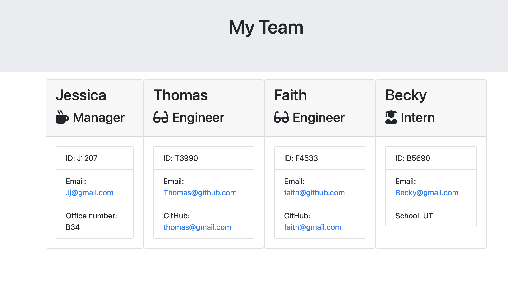

# Team Profile Generator 

  ## Table of Contents:
  * [Description](#description)
  * [Installation](#installation)
  * [Usage](#usage)
  * [Questions](#questions)

  ## Description:
Your challenge is to build a Node.js command-line application that takes in information about employees on a software engineering team and generates an HTML webpage that displays summaries for each person. 

  ## Installation:
 - npm Inquirer Package 
 - npm Jest - javascript testing 

  ## Usage:
  

  #### Video:
  https://drive.google.com/file/d/1L7ehI7jbKpAkBU4KPbZA4R1_en20gRS_/view

  ## Questions:
  If you have any questions please reach out to me at:

  GitHub - https://github.com/jrjensen14
  
  Email - jrjensen@gmail.com

